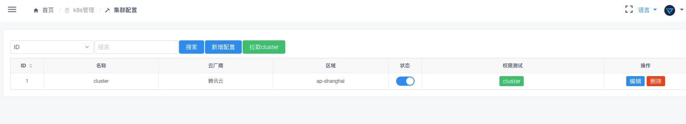

.. _topics-k8s管理:

==========
k8s管理
==========

集群列表
=========

.. note::
    集群的一些基本信息，可以操作添加节点到集群，添加的节点都必须有 env 标签，目前这个没有加入审批

集群配置
=========

.. note::

    用于拉取集群的信息

集群资源回收
===========

``未开发``

.. note::

    |   回收集群中的实例,需要审批

    - 锁定实例
    - 排空实例
    - 回收实例

