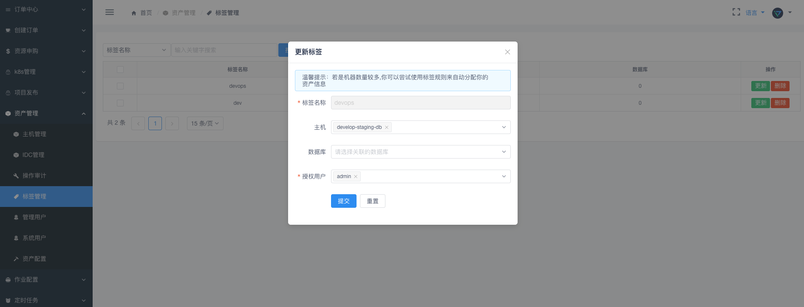
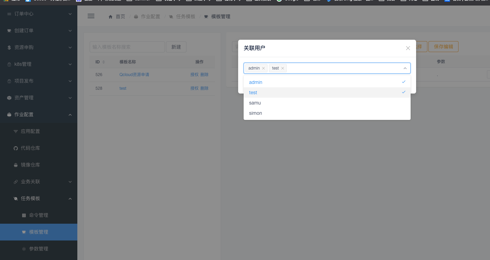

.. _topics-用户管理:

==========
用户管理
==========

用户列表
=========

|   默认登陆用户admin已经是超级管理员权限

``mg_users`` 表字段 superuser

    - 0：代表超级管理员
    - 10：代表普通用户

.. note::

    用来管理和展示用户的列表，记录用户的详细信息

权限列表
==========

.. note::
    新增接口，新增权限接口。管理员拥有所有权限

    | 功能说明

        - 支持多种搜索方式，如：权限名称、请求路径、请求方法、时间等
        - 支持新增、编辑、关闭、删除等操作权限的管理
        - 支持新增自定义权限功能，适用于开发人员编写的API接口能很方便的接入进来权限管理划分

菜单组件
==========

.. note::
    导航栏所看到的功能模块（如：用户管理、系统管理）和一些功能按钮（如：编辑、删除按钮）

    .. image:: ../images/menus.png

角色管理
==========

.. note::
    基于RBAC角色管理访问控制权限，可以很精细/方便的管理你的用户权限

    | 功能介绍
        自定义角色名字，自定义赋权组件、菜单、权限管理

    .. image:: ../images/role.png

资产管理授权
============

.. note::

    资产管理是支持针对Tag标签对普通用户授权 展示不同的资产。
    用户授权后才能看到

Task任务模板授权
=================

.. note::

    我们的任务模板都是有权限之分的，当管理创建好了一个任务模板需要相关用户进行授权，否则其余用户是不能对模板操作/显示此模板的任务的

