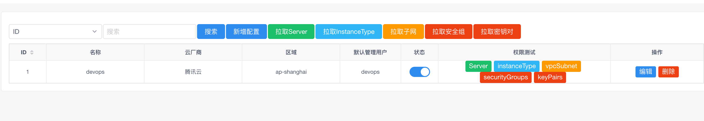

.. _topics-资产管理:

==========
资产管理
==========
标签管理
==========
.. note::
    将机器分类

管理用户
==========
.. note::
    将私钥放在平台上，平台是根据这个私钥去连接主机

资产配置
=========

.. note::

    更新所有资产信息，包括主机相关信息

    - 只有状态按钮为开启状态，系统才会去你配置的区域里面去拉取主机信息
    - 请确保你填写的AccessID/AccessKey/Region区域信息的准确性，可点击测试按钮进行测试权限
    - 确保你机器的Hostname是唯一值
    - 默认管理用户：此用户是可以登陆机器的，若此处填写了默认管理用户，会自动给机器关联上此用户，用于后续资产更新连接使用
    - 自动获取来的机器状态都是Auto状态，若不配置管理用户，默认资产详情信息都是从云平台获取的一些基本信息，若配置了管理用户并更新了资产，资产信息来源基于系统本身获取到的
    - 拉取资产按钮：手动触发云厂商主机更新到主机列表,定期拉取接口暂时停用

